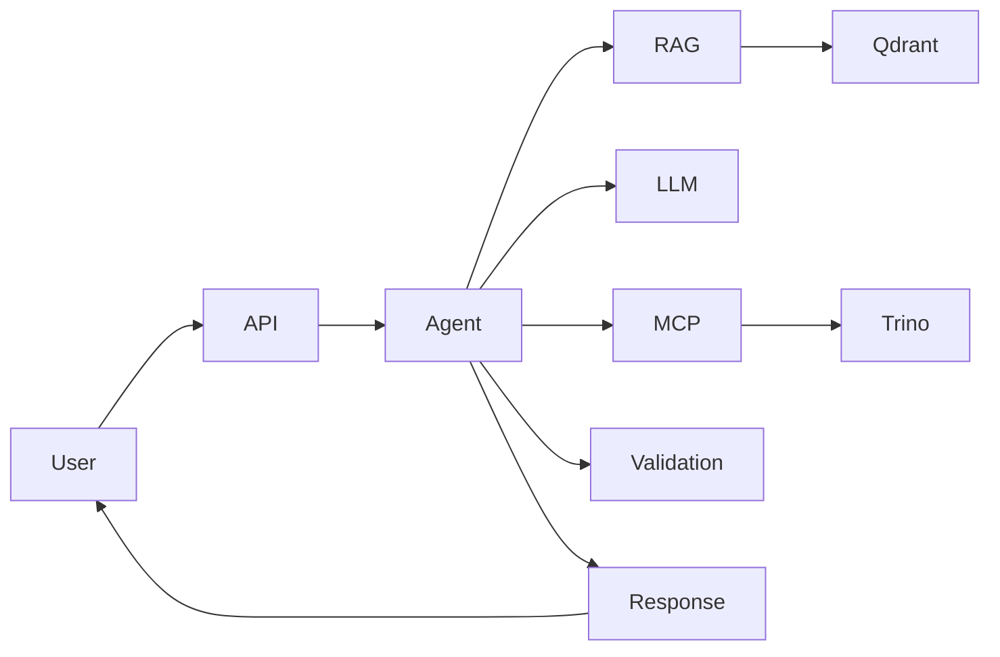

# Enterprise Big Data Copilot

> An AI copilot that turns natural-language questions into validated, schema-aware Trino SQL, using RAG, MCP tools, and local LLM inference.

## Overview

Enterprise Big Data Copilot lets users query Big Data platforms in plain English. A LangGraph pipeline retrieves relevant documentation (RAG) and live schema metadata (MCP), generates SQL with a local LLM (Ollama), validates it against safety and schema rules, and — when the platform is reachable — executes it on Trino and returns real rows.

## Features

- Natural-language Text-to-SQL generation for Trino
- Local LLM inference with Ollama (no cloud API required)
- RAG retrieval over Trino / Hive / Iceberg documentation (Qdrant)
- Schema-aware generation grounded in live catalog metadata
- SQL validation (read-only SELECT enforcement, parse check, schema grounding) with an automatic regeneration loop
- Best-effort query execution and result retrieval from Trino
- Model Context Protocol (MCP) server exposing metadata, query, and profiling tools
- OpenAI-compatible API for Open WebUI

## Architecture



## Tech Stack

| Technology | Purpose |
| ---------- | ------- |
| Python + FastAPI | Backend and REST/OpenAI-compatible API |
| LangGraph | Pipeline orchestration (RAG → schema → SQL → validate → execute) |
| Ollama | Local LLM (`llama3.2`) and embeddings (`mxbai-embed-large`) |
| LangChain + Qdrant | RAG document retrieval |
| FastMCP | Model Context Protocol server (tools) |
| Trino | SQL query engine (TPCH demo catalog) |
| Open WebUI | Chat UI (optional) |
| Docker | Containerized infrastructure |

## Project Structure

```text
app/
├── agent/            # SQL agent + prompts (Ollama)
├── api/              # REST + OpenAI-compatible endpoints
├── core/             # Config, models, exceptions, logging
├── formatter/        # Response formatting
├── mcp/              # MCP server, client, catalog services
├── orchestrator/     # LangGraph pipeline
├── rag/              # Ingestion and retrieval (Qdrant)
├── services/         # Trino client
└── validator/        # SQL validation
tests/                # pytest suite
docker/               # App image + Trino config
docs/                 # RAG knowledge base
scripts/              # Document ingestion CLI
```

## Getting Started

### Prerequisites

- Python **3.11 or 3.12** (3.13 is not supported)
- Docker + Docker Compose
- GPU optional (Ollama can run on CPU)

### Installation

```bash
git clone https://github.com/hani-ben-dhaou/Enterprise-Big-Data-Copilot.git
cd entreprise-bigdata-copilot

python -m venv .venv
# Windows: .venv\Scripts\activate | macOS/Linux: source .venv/bin/activate

pip install -r requirements.txt
pip install -r requirements-dev.txt   # pytest
```

### Configuration

```bash
cp .env.example .env
```

Key variables (defaults work for local dev):

| Variable | Description |
| -------- | ----------- |
| `OLLAMA_BASE_URL` / `OLLAMA_MODEL` | LLM server and model (`llama3.2`) |
| `OLLAMA_EMBED_MODEL` | Embedding model (`mxbai-embed-large`) |
| `QDRANT_HOST` / `QDRANT_PORT` | Qdrant vector database |
| `TRINO_HOST` / `TRINO_PORT` / `TRINO_CATALOG` / `TRINO_SCHEMA` | Trino (default catalog `tpch`, schema `tiny`) |
| `MCP_TRANSPORT` | `inprocess` (default, recommended on Windows) or `sse` |
| `MCP_METADATA_SOURCE` | `inmemory` (demo catalog) or `trino` (live metadata) |
| `ENABLE_SQL_EXECUTION` | Run validated SQL on Trino |

### Run

```bash
# 1. Start infrastructure (Ollama, Qdrant, Trino)
docker compose up -d

# 2. Pull models and ingest documentation (Qdrant must be up)
docker exec -it copilot-ollama ollama pull llama3.2
docker exec -it copilot-ollama ollama pull mxbai-embed-large
python scripts/ingest_docs.py

# 3. Start the API
uvicorn app.main:app --reload --port 8000

# 4. Optional: standalone MCP server (SSE on :8001)
python -m app.mcp.server
```

## Usage

Ask a question in natural language:

```bash
curl -X POST http://localhost:8000/api/v1/query \
  -H "Content-Type: application/json" \
  -d '{"question":"Show me the top 10 customers by total revenue last month"}'
```

The response includes the generated SQL, an explanation, a confidence score, warnings, and — when execution is enabled — the result rows:

```json
{
  "question": "Show me the top 10 customers by total revenue last month",
  "sql": "SELECT ...",
  "explanation": "...",
  "confidence": 0.92,
  "warnings": [],
  "dialect": "trino",
  "results": [["42", "Acme", 98765.00]],
  "execution": {"status": "ok", "columns": ["id", "name", "revenue"], "row_count": 1, "truncated": false}
}
```

Other endpoints: `GET /api/v1/schema` (list catalog), `GET /api/v1/health`, and `POST /v1/chat/completions` (OpenAI-compatible, used by Open WebUI).

## Testing

```bash
pytest
```

The suite is hermetic and runs without a live stack (146 tests).

## Docker

`docker compose` runs the full stack:

| Service | Container | Port |
| ------- | --------- | ---- |
| Ollama | `copilot-ollama` | 11434 |
| Qdrant | `copilot-qdrant` | 6333 |
| Trino | `copilot-trino` | 8080 |
| Open WebUI | `copilot-webui` | 3000 |
| Copilot API | `copilot-api` | 8000 |
| MCP Server | `copilot-mcp` | 8001 |

Named volumes persist Ollama models, Qdrant data, and Open WebUI data. The `ollama` volume is declared `external` — create it once if not present:

```bash
docker volume create ollama
docker compose up -d
docker compose ps
docker compose logs -f copilot-api
docker compose down
```

> **Windows note:** MCP over real SSE can be flaky on the Windows event loop. Keep `MCP_TRANSPORT=inprocess` for local development on Windows; use SSE on Linux/Docker.